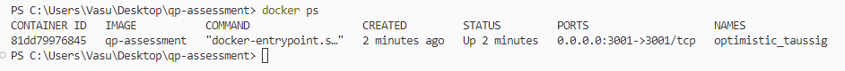

# qp-assessment

This **Node.js** project, written in **TypeScript**, employs **Express.js** for server-side operations and **Pino logger** for logging. 
The application is containerized using **Docker**, and it utilizes a **MySQL database** for data storage. 
It caters to two types of users: admin and regular users.
The application has an authentication layer that uses **JWT** tokens for authentication and authorization checks

## Features

- **Admin Privileges:** Admin users can add, remove, and update items in the inventory.
- **User Functionality:** Regular users can view the list of items, add them to their cart, remove items from their cart, and proceed to checkout.

## Setup Instructions

### Prerequisites
- Node.js installed on your machine ([Node.js Installation Guide](https://nodejs.org/en/download/))
- Docker installed on your machine ([Docker Installation Guide](https://docs.docker.com/get-docker/))

### Installation
1. Clone this repository to your local machine.
2. Navigate to the project directory.
```bash
git clone <clone-url>
cd qp-assessment
```

3. Install packages
```bash 
npm install
```
4. Create .env and assign following values
```
# Server config variables
PORT = 3001
HOSTNAME = "127.0.0.1"

# JWT token key
SALT = "qp-assessment"

# mySQL variables
DBNAME = "qpassessment"
DBUSER = "root"
DBHOST = "localhost"
DBPASS = "vasu"
```

5. Run the application in development mode
```bash
npm start dev
```

### Build
```bash
npm run build \\Creates a build directory (Currently ignored)
npm run start
```

## Sample docker build steps
```bash
docker build -t qp-assessment .
docker run -d -p 3001:3001 qp-assessment
```


### Project structure
```
.
│   controllers/        # Controllers for handling requests
│   config/           	# Configuration and scripts
│   models/             # Database models / Types
│   router/             # Route definitions
│   server/             # Contains server files
|   services/			# Service files for controllers
|	types/				# Custom types for the server
| 	utils/				# Utility functions
│   app.ts              # Main application file
├── Dockerfile          # Docker configuration file
├── tsconfig.json       # TypeScript configuration
├── package.json        # npm package file
└── README.md           # Project README file
```
